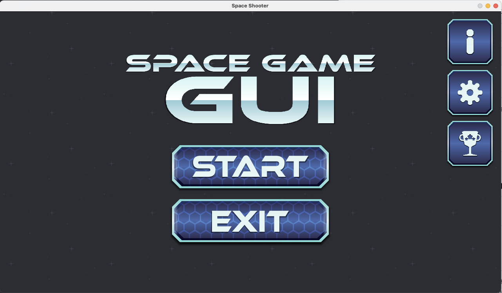
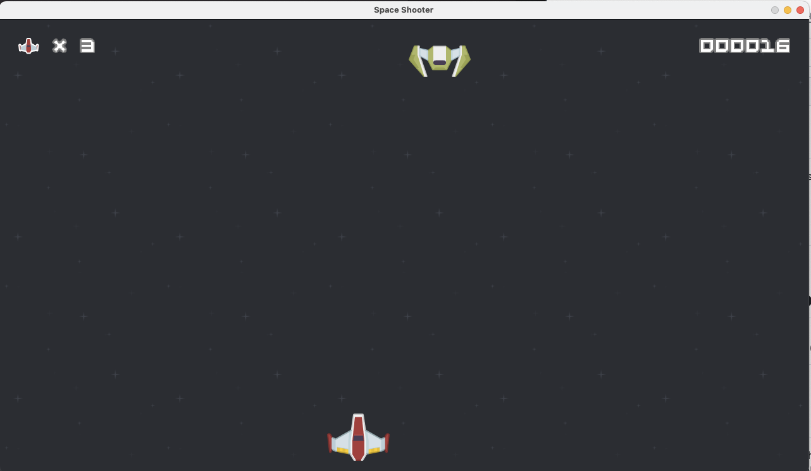
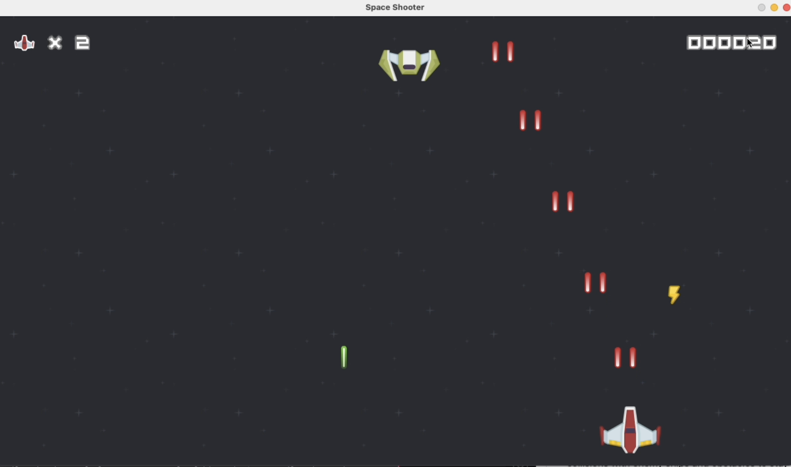

# Space-shooter
Welcome to the Space Shooter Game! This game is a classic arcade-style shooter where you control a spaceship to defend against enemy attacks and obstacles.
# Getting Started
Prerequisites
Python 3.x installed on your machine
Libraries required: pygame

# Clone the repository to your local machine
 
# Install the required dependencies using pip:
pip install pygame

# How to Play

Use the arrow keys to move the spaceship.
Press the space bar to shoot lasers and destroy enemy ships and obstacles.
Avoid collisions with enemy ships and obstacles to stay alive.
Collect power-ups to upgrade your spaceship and gain new abilities.

# Features

Multiple stages with increasing difficulty levels.
Various enemy ships and obstacles to challenge your skills.
Power-ups to enhance your spaceship's capabilities.
High scores to track your progress and compete with friends.

